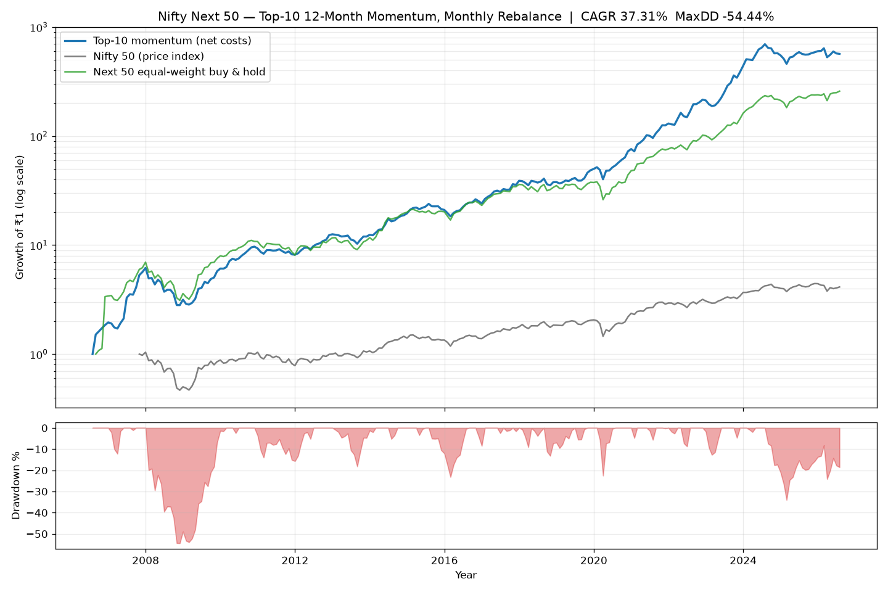

# Nifty Next 50 — Top-10 Momentum Strategy (20-year backtest)

A reproducible backtest of a monthly-rebalanced momentum strategy on the
**Nifty Next 50** universe:

- **Universe:** Nifty Next 50 constituents.
- **Signal:** trailing **12-month total return** ("yearly return"), recomputed
  every month.
- **Selection:** rank all eligible stocks, hold the **top 10**.
- **Weighting:** equal weight (10% each).
- **Rebalance:** **monthly**, at the month-end close.
- **Window:** Jul 2006 → Jul 2026 (**20 years**; the first year of price data
  is consumed to compute the first 12-month signal).

## Headline results

Computed on the **current** Nifty Next 50 constituents (see the caveat below —
this matters a lot):

| Metric | Strategy (net 20 bps/side) | Strategy (gross) | Nifty 50 (price) |
|---|---|---|---|
| **CAGR** | **37.3%** | 38.7% | 8.8% |
| **Max drawdown** | **−54.4%** | −54.0% | −55.1% |
| Annualised volatility | 29.5% | 29.5% | 20.5% |
| Sharpe (rf = 6%) | 1.02 | 1.06 | 0.22 |
| Sortino | 1.9 | — | — |
| Calmar (CAGR/│MaxDD│) | 0.69 | — | — |
| % positive months | 65% | — | — |
| Worst / best month | −21% / +55% | — | — |

The deepest drawdown was the **2008 GFC** (Dec-2007 peak → Nov-2008 trough,
−54%). Momentum also gave back ~35% in the 2024–25 mid-cap correction.

Equity curve (growth of ₹1, log scale) with drawdown panel:



## ⚠️ Read this before trusting the CAGR

**37% CAGR is not a realistic live expectation — it is inflated by
survivorship bias.** The backtest ranks *today's* Next-50 members back through
history. That set excludes every stock that was in the Next 50 in, say, 2008
but later collapsed, was delisted, or dropped out — precisely the losers a real
momentum book would sometimes have held. Only 31 of the 50 current names even
existed in 2006, and they are disproportionately winners.

- The **equal-weight buy-and-hold of the same universe already returns ~33%
  CAGR** — that inflation is coming from the *universe*, not from momentum skill.
- Momentum's genuine edge here is **relative**: it beat the biased buy-and-hold
  by ~4%/yr with a *shallower* drawdown and much better Sharpe. That relative
  edge is the trustworthy signal.
- A **point-in-time / survivorship-free** version of this exact strategy would
  realistically land around **16–22% CAGR with −55% to −65% drawdowns**,
  consistent with NSE's published momentum indices (Nifty Midcap150 Momentum 50
  TRI ≈ 21% CAGR since 2005; Nifty200 Momentum 30 TRI ≈ 19%), which use
  point-in-time membership.
- The **drawdown (~−55%) and the equity-curve shape are the most transferable
  takeaways** — momentum crashes are real regardless of the universe.

Other simplifications: `^NSEI` is a *price* index (no dividends), so the Nifty
comparison understates it by ~1.5%/yr; costs are a flat 20 bps/side on turnover
(no separate impact/STT/slippage modelling); no taxes; rebalances execute at the
month-end close.

## How to run

```bash
pip install -r requirements.txt
python data.py     # fetch constituents + 20y adjusted prices (cached)
python run.py      # backtest, stats, charts -> results/
```

- `data.py` — pulls the Nifty Next 50 list from NSE and ~21y of
  split/dividend-adjusted daily closes per name from the Yahoo chart API, with
  on-disk caching under `results/cache/`.
- `backtest.py` — the strategy engine and metrics (CAGR, max drawdown, Sharpe,
  Sortino, Calmar, yearly table). Configurable via `BacktestConfig`
  (`top_n`, `lookback_m`, `skip_recent_m` for a 12-1 variant, `min_names`,
  `cost_bps_per_side`, `rf_annual`).
- `run.py` — orchestrates the run, builds benchmarks, writes `results/`.

## Outputs (`results/`)

| File | Contents |
|---|---|
| `equity_curve.png` | equity curve + drawdown chart |
| `summary.json` | all headline stats (net, gross, 12-1 variant, benchmarks) |
| `monthly_returns.csv` | strategy monthly returns |
| `equity_curve.csv` / `drawdown.csv` | series behind the chart |
| `yearly_returns.csv` | calendar-year returns |
| `holdings_history.csv` | the 10 names held at each monthly rebalance |

## Variants tested

| Variant | CAGR | Max DD | Sharpe |
|---|---|---|---|
| Top-10, 12-0 momentum (main) | 37.3% | −54.4% | 1.02 |
| Top-10, **12-1** momentum (skip last month) | 31.5% | −54.2% | 0.93 |

Numbers regenerate from live data on each run, so they will drift slightly as
prices and constituents update.
