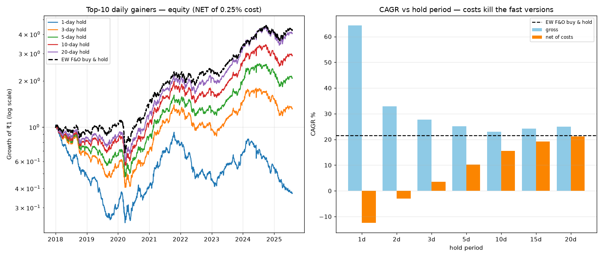

# Top-10 F&O Daily-Gainers — Backtest

**Question:** In the NSE F&O list, if I take the top 10 stocks by daily change%,
how many days do they sustain, and what CAGR%, hold period and drawdown result?

**Short answer (2018-01 → 2025-07, 218 F&O stocks):**

| Metric | Result |
|---|---|
| How long a top-10 gainer **sustains** in the top-10 | **~1 day** (mean 1.12, median 1; **90% drop out the very next day**) |
| Is there a momentum **edge**? | Almost none — next-day **median return is −0.02%**, win-rate ~49%. The positive mean (+0.22%) is a thin fat-tail effect. |
| **CAGR** of flipping the basket daily (1-day hold), **net of costs** | **−12% CAGR**, **−77% max drawdown** — it loses money |
| Best **net** hold period | 20 days → **+21% CAGR, −40% DD** … which merely **ties** a plain equal-weight F&O buy-&-hold (**+21% CAGR, −38% DD**) |
| Verdict | The literal "chase the biggest daily gainers" strategy **does not work after costs.** The signal is basically noise; the only way it turns positive is to hold so long that turnover collapses, at which point you're just closet-indexing the F&O universe. |



Full write-up with all tables: [`results/report.md`](results/report.md).

---

## Why the fast version fails

- **Gross**, a 1-day flip looks amazing (+64% CAGR) because a handful of stocks
  keep running for one more day. But being a top-10 gainer only lasts ~1 day and
  the *median* follow-through is slightly **negative** — it is a fat-tailed
  coin-flip, not a durable edge.
- The strategy turns over ~100% of the book **every day**. At a realistic
  0.25% round-trip cost that is ~63% of capital paid in friction per year, which
  turns +64% gross into **−12% net**.
- Stretching the hold to 10–20 days cuts turnover (and cost) enough to go
  positive, but by then the "gainer" signal has washed out and the book behaves
  like the whole F&O universe — so it just matches buy-and-hold, with a **worse
  drawdown**.

## What the numbers mean for the four asks

1. **Sustain:** ~1 day. The premise ("they keep running") mostly isn't true.
2. **Hold period:** the *natural* hold (until it exits the top-10) is ~1 day;
   the *best net* hold is the longest tested (20 days), for cost reasons only.
3. **CAGR:** −12% (daily flip, net) up to +21% (20-day, net) — none beats the
   +21% benchmark.
4. **Drawdown:** −77% (daily flip) down to −40% (20-day); benchmark −38%.

## How to reproduce

```bash
pip install -r requirements.txt

# download prices + run the full analysis (writes results/report.md + CSVs)
python -m fo_top10.analyze --start 2018-01-01 --end 2025-08-01 --top 10

# regenerate the chart
python -m fo_top10.plot
```

Data is cached to `data/fo_prices.csv`; delete it or pass `--force` to
re-download. Tune the strategy with `--top` (basket size) and `--cost`
(round-trip cost fraction).

## Layout

```
fo_top10/
  universe.py   # NSE F&O stock list (Yahoo .NS symbols)
  data.py       # Yahoo chart-API downloader (proxy-friendly, cached)
  backtest.py   # selection, sustain/persistence stats, strategy, metrics
  analyze.py    # orchestrates the run, writes results/report.md
  plot.py       # equity-curve + CAGR charts
results/        # report.md, CSVs, summary.png
data/           # cached prices
```

## Method notes & caveats

- **Selection:** each day rank all F&O names by that day's % change, take the
  top 10 (equal-weight). Entry/exit at the **close**. No look-ahead: selection
  uses only day-t information; returns are earned from day t+1.
- **Overlapping cohorts:** for an *H*-day hold, capital is split across *H*
  daily cohorts so the book stays fully invested.
- **Costs:** net figures charge 0.25% round-trip on the fraction rebalanced
  each day (1/H). Real slippage chasing gappy movers is likely worse.
- **Constituent/survivorship bias:** the current F&O list is applied over the
  whole window; dropped names are missing, which *flatters* results — the real
  strategy would look worse, not better.
- **Data:** Yahoo Finance adjusted close; occasional gaps/adjustment errors.
  218 of ~222 F&O names resolved. Figures are indicative, not exact.
