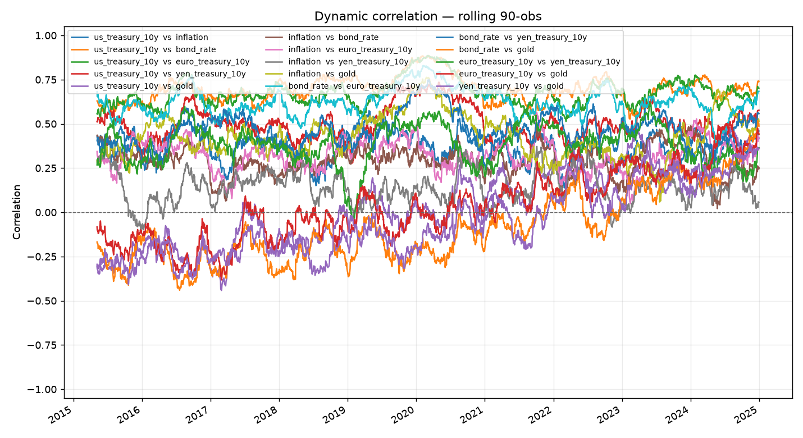

# dyncorr — dynamic correlation tool

Correlation between financial series is **not one number** — it moves through
time. Gold vs. real yields, Bunds vs. Treasuries, stocks vs. bonds: each can be
strongly positive in one regime and negative in the next. `dyncorr` measures
that *time-varying* correlation between any set of parameters you choose:

- **US Treasuries** (2Y / 10Y / 30Y yields)
- **Inflation** (10Y breakeven) and **CPI**
- **Bond rates** (Baa corporate)
- **Euro Treasuries** (German Bund) and **Yen Treasuries** (JGB)
- **Gold**, plus equities, FX, oil, the dollar index, VIX
- …or **any other parameter** — load your own series from a CSV.

It computes a static full-sample correlation matrix, two dynamic estimators
(**rolling window** and **exponentially-weighted / RiskMetrics**), a "which
relationships are least stable" ranking, and renders a rolling-correlation
chart and a current-correlation heatmap.



---

## Install

```bash
pip install -r requirements.txt      # numpy, pandas, matplotlib
# or install the package (adds the `dyncorr` command):
pip install -e .
# optional, for live data:
pip install -e ".[live]"             # yfinance + pandas-datareader
```

Python 3.9+.

## Quick start

Works fully offline — the default data source is a deterministic **synthetic**
generator with realistic, *time-varying* correlations, so you can try
everything with no network access or API keys.

```bash
# See every built-in parameter and alias
python -m dyncorr list-presets

# Dynamic correlation of the parameters from the brief (offline synthetic data)
python -m dyncorr run \
    --params us_treasury_10y inflation bond_rate \
             euro_treasury_10y yen_treasury_10y gold \
    --method rolling --window 90 --outdir out

# Exponentially-weighted (reacts faster than a fixed window)
python -m dyncorr run --params gold us_treasury_10y inflation \
    --method ewma --halflife 30

# Focus on specific pairs only
python -m dyncorr run --params gold us_treasury_10y sp500 \
    --pairs gold~us_treasury_10y gold~sp500
```

If you installed the package, use the `dyncorr` command instead of
`python -m dyncorr`.

## Interactive dashboard

Generate a single self-contained HTML page that computes the correlations
**in the browser** — the estimator, window/half-life, anchor and "as-of date"
controls are all live, with a rolling-correlation chart, an as-of heatmap, and
a swing-ranked stability table.

```bash
python -m dyncorr dashboard \
    --params us_treasury_10y us_treasury_2y inflation bond_rate \
             euro_treasury_10y yen_treasury_10y gold sp500 \
    --out dashboard.html
# then open dashboard.html in any browser (no server needed)
```

It works with `--csv` and `--source live` too, exactly like `run`.

## Use your own data (any parameter)

Provide a wide CSV: a date column plus one numeric column per series (levels —
prices or yields). Column names become the parameter names.

```bash
python -m dyncorr run --csv examples/sample_prices.csv \
    --params gold us_treasury_10y inflation --method rolling --window 60
```

`dyncorr` picks a sensible transform per column: recognised presets follow
their recommendation (yields are **differenced**, prices become **log
returns**), and unknown columns default to log returns. Override globally with
`--transform {auto,level,diff,returns,log_returns,zscore}`.

## Live data (optional)

```bash
python -m dyncorr run --source live \
    --params gold us_treasury_10y euro_treasury_10y \
    --start 2018-01-01 --method ewma --halflife 30
```

Yields/macro come from **FRED** (`pandas-datareader`) and market prices from
**Yahoo Finance** (`yfinance`). Both are optional dependencies and require
network access; missing series are skipped with a warning.

## Outputs

Every `run` writes to `--outdir` (default `dyncorr_out/`):

| File | Contents |
|------|----------|
| `dynamic_correlation.csv` | Pairwise correlation time series (one column per pair) |
| `static_correlation.csv` | Full-sample correlation matrix |
| `current_correlation_matrix.csv` | Correlation as of the last observation |
| `summary.csv` | Per-pair latest / mean / min / max / **swing** |
| `dynamic_correlation.png` | Rolling/EWMA correlation chart |
| `current_correlation_heatmap.png` | Heatmap of the current matrix |

The **swing** column (max − min) ranks pairs by how much their correlation has
moved — a quick read on which relationships are the least stable.

## Python API

```python
from dyncorr import build_panel, dynamic_correlation, correlation_summary

panel = build_panel(["gold", "us_treasury_10y", "inflation"], source="synthetic")
roll = dynamic_correlation(panel.transformed, method="rolling", window=60)
print(correlation_summary(roll))
```

Key building blocks: `build_panel`, `static_correlation`,
`rolling_correlation`, `ewma_correlation`, `dynamic_correlation`,
`matrix_as_of`, `correlation_summary`.

## How it works

1. **Panel** — resolve each parameter to a level series (preset, CSV, live, or
   synthetic), align on dates, and transform (diff for rates, log returns for
   prices) so we correlate *changes*, not shared trends.
2. **Dynamic estimators**
   - *Rolling*: Pearson correlation over a trailing `--window` of observations.
   - *EWMA*: every past observation contributes, weighted by `--halflife`
     decay (the RiskMetrics estimator) — no hard window edge.
3. **Report** — static matrix for reference, the dynamic series, a stability
   ranking, and the correlation matrix as of the latest date.

The synthetic generator drives series with a small factor model in which a few
loadings vary over time (gold's dependence on rates deliberately flips from
negative to positive across the sample), and yields follow a mean-reverting
process — so the dynamic tool has genuine time-variation to reveal offline.

## Tests

```bash
pip install pytest
pytest -q
```

## Notes

- Mixed-frequency series (daily prices vs. monthly macro) are aligned by
  dropping dates without full coverage. For live monthly macro (Bund/JGB via
  FRED), expect fewer overlapping observations; prefer longer `--start` ranges.
- This is an analysis tool, not investment advice.
