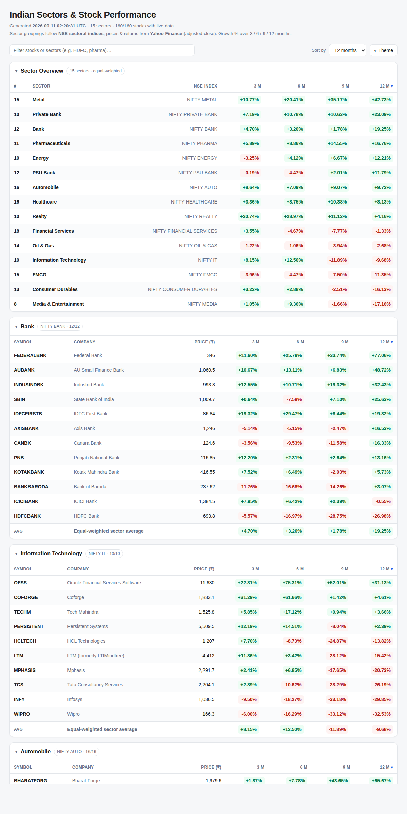

# Indian Sectors & Stock Performance

Lists the **whole Indian market across 72 industry groups** — from Banks and IT
to Defence, Specialty Chemicals, Cables & Wires and Restaurants/QSR — with each
group's constituent stocks and their **price growth %** over **3, 6, 9 and 12
months**, plus an equal-weighted sector average.

- **72 sectors**, grouped under 12 macro-economic sectors, following the **NSE
  macro → sector → industry classification**. This is far finer than the ~15
  tradeable NSE sectoral indices: "Auto", for example, is split into Passenger
  Vehicles, Two & Three Wheelers, Commercial Vehicles, Tyres, Auto Components
  and Batteries & EV.
- **~530 constituent stocks**, prices & returns from **Yahoo Finance** (adjusted
  close, so returns include splits and dividends).
- **Zero third-party dependencies** — pure Python standard library, Python 3.9+.



---

## Quick start

```bash
# 1. Fetch live data and build the dataset (~15 s for ~530 stocks)
python run.py generate

# 2a. See it in the terminal
python run.py show                       # 72-sector leaderboard, sorted by 12m
python run.py show --sector defence      # one sector's stocks
python run.py show --sort 3m             # sort by a different period

# 2b. …or open the web dashboard (browsers block fetch over file://, so serve it)
python -m http.server 8000
#     then open  http://localhost:8000/
```

List the full sector → stock mapping (grouped by macro sector, no network):

```bash
python run.py list
```

---

## The decision system (framework → numbers)

Three engines turn [**The Investor's Framework**](docs/investment-framework.md)
into concrete answers. See [`docs/decision-system.md`](docs/decision-system.md)
for the formulas, assumptions and worked examples.

```bash
# 1. Which stock, at what price?  Intrinsic value (DCF) + margin of safety.
python run.py value --eps 50 --growth 0.15 --years 10 \
                    --bond-yield 0.07 --erp 0.05 --price 700 --implied
#   → intrinsic value, how much comes from the terminal, margin of safety,
#     a BUY/ACCUMULATE/HOLD/AVOID verdict, and the growth the price bakes in.
#   Pass --symbol TCS.NS instead of --price to pull a live price.

# 2. Which asset to sell / buy?  Counter-trend rebalance to a target mix.
python run.py rebalance --holding equity=750000 --holding gold=150000 \
                        --holding bonds=100000 --profile balanced --band 0.03
#   Add --new-money 100000 to rebalance with fresh cash (no selling), or
#   --years-to-goal 3 to apply the equity→bond glide path.

# 3. How to pyramid?  A price-laddered plan that stops adding at fair value.
python run.py pyramid --entry 100 --intrinsic 130 --budget 100000 \
                      --tranches 6 --step 0.08 --decay 0.65 --cap 1.0
```

There is also a **no-install interactive calculator**: open `web/strategy.html`
in a browser (all three engines, recomputing live — nothing to run).

Run the engine tests with:

```bash
python -m unittest discover -s tests -v
```

---

## What you get

**72 sectors, ~530 constituent stocks.** Example (`python run.py show`):

```
SECTOR PERFORMANCE (equal-weighted average return %)
                                   3m       6m       9m      12m
----------------------------------------------------------------
Telecom Equipment &  (5/5)     +13.54  +123.27  +208.96  +172.97
Cables & Wires       (6/6)     +14.59   +57.56   +61.76   +69.94
Two & Three Wheelers (5/5)     +23.58   +33.96   +41.03   +54.12
Defence              (11/11)    +7.34   +25.86   +36.28   +28.48
Banks – Private      (12/12)    +7.68   +11.86   +16.17   +28.44
...
```

The web dashboard (`index.html`, and the shareable screener artifact) adds:

- A **sector leaderboard** — all 72 sectors ranked by any period, with in-cell
  magnitude heat-bars; click a sector to jump to its detail.
- **Macro-grouped, collapsible per-sector tables** with live price and 3/6/9/12
  month growth %, colour-coded green/red.
- **Macro filter** (Financials, Energy & Utilities, …), **sort** by any period,
  and **search** across symbol / company / sector / macro.
- Light / dark theme, responsive down to phone width.

---

## The 72 sectors, by macro group

| Macro sector | Industry groups |
|---|---|
| **Financials** | Banks – Private · Banks – Public Sector · Small Finance & Microfinance · NBFC · Housing Finance · Life Insurance · General & Health Insurance · Asset Management · Capital Markets & Exchanges · Fintech, Payments & Internet |
| **Information Technology** | IT Services & Consulting · Software Products & Platforms · Electronics Manufacturing (EMS) |
| **Consumer Discretionary** | Passenger Vehicles · Two & Three Wheelers · Commercial Vehicles · Tyres · Auto Components · Batteries & EV · Consumer Durables & Appliances · Footwear · Jewellery & Watches · Retail |
| **Consumer Staples** | Packaged Foods · Beverages · Personal & Household Care · Tobacco · Sugar · Breweries & Distilleries · Agri & Edible Oils |
| **Healthcare** | Pharmaceuticals · Hospitals · Diagnostics · CRAMS & Contract Research |
| **Energy & Utilities** | Oil E&P · Oil Refining & Marketing · Gas Distribution · Power Generation · Power Transmission & Distribution · Renewable Energy · Coal · Lubricants |
| **Metals & Mining** | Iron & Steel · Aluminium & Non-Ferrous · Mining & Minerals |
| **Chemicals** | Specialty Chemicals · Commodity Chemicals · Fertilizers · Agrochemicals · Paints · Plastics & Packaging |
| **Construction & Materials** | Cement · Building Materials · Cables & Wires · Real Estate · Construction & Engineering (EPC) |
| **Industrials** | Capital Goods & Electrical · Industrial Machinery & Bearings · Defence · Railways · Ports & Marine · Logistics · Aviation & Airports |
| **Telecom, Media & Hospitality** | Telecom Services · Telecom Equipment & Infrastructure · Media & Entertainment · Hotels & Tourism |
| **Diversified & Others** | Textiles & Apparel · Paper & Forest Products · Diversified / Conglomerates · Shipping · Restaurants & QSR |

---

## How growth % is computed

For each stock the tool pulls ~13 months of daily adjusted-close prices and, for
each period *N* ∈ {3, 6, 9, 12} months:

```
growth% = (latest_adjusted_close / adjusted_close_N_months_ago − 1) × 100
```

The base price is the last trading day **on or before** the target calendar date.
Each figure records `coverage_days` (how much history actually backed it) and each
stock records `history_days`, so partial figures are transparent, not hidden.

**Sector figure** = the equal-weighted average of its constituents' returns — a
simple, readable aggregate, **not** the official free-float market-cap-weighted
index return.

---

## Data sources & the NSE note

The sector taxonomy mirrors the **NSE industry classification**.
`sector_stocks/nse.py` can refresh constituents **live from NSE**
(`/api/equity-stockIndices`) when the exchange is reachable. In practice NSE
aggressively blocks datacenter / cloud IP ranges (HTTP 403), so from a server the
live refresh usually fails and the tool uses the **bundled constituent list** in
`sector_stocks/sectors.py`. All **price** data comes from Yahoo Finance, which is
reliably reachable.

### Corporate actions handled

Constituent symbols track recent restructurings, e.g.: **LTIMindtree → LTM**,
**Gujarat Gas → Gujarat Energy**, **Tata Motors** demerged into **TMPV + TMCV**,
**TV18 Broadcast** merged into **Network18**, **Kalpataru → KPIL**, **Hitachi
Energy India = POWERINDIA**, **Godawari = GPIL**. A few names Yahoo only carries
on BSE (e.g. **SpiceJet**, via a `.BO` override). Stocks with limited history
(recent listing / demerger) are flagged ⚠ in the dashboard and their longer-period
returns are partial.

---

## Automatic daily updates

The data is **not** live — it is a snapshot produced by `python run.py generate`.
Two mechanisms keep it fresh daily:

1. **GitHub Actions** (`.github/workflows/update-data.yml`) regenerates
   `output/sector_performance.json`, rebuilds `web/screener.html`, sanity-checks
   coverage (≥ 80 % of stocks must fetch), and commits — every weekday at
   **7 PM IST** (after the NSE close). GitHub only runs scheduled workflows from
   the **default branch**, so this begins firing once merged to `main`; until
   then, trigger it manually from the repo's **Actions → Update sector data →
   Run workflow**.

2. **Live artifact republish** — the shareable dashboard link embeds its data and
   cannot self-refresh, so a scheduled Claude routine regenerates and republishes
   it daily. Rebuild it manually anytime with:

   ```bash
   python run.py generate && python scripts/build_artifact.py
   ```

Markets trade Mon–Fri; Yahoo occasionally rate-limits cloud/CI IPs, which is why
the workflow refuses to commit a partial pull.

---

## Project layout

```
Mohit/
├── run.py                       # CLI: generate / show / list / value / rebalance / pyramid
├── index.html                   # web dashboard (reads output/sector_performance.json)
├── output/
│   └── sector_performance.json  # generated dataset (a snapshot is committed)
├── web/
│   ├── screener_template.html   # artifact template (/*__DATA__*/ placeholder)
│   └── screener.html            # standalone artifact page (data embedded)
├── scripts/
│   └── build_artifact.py        # builds web/screener.html from template + data
├── .github/workflows/
│   └── update-data.yml          # daily GitHub Actions refresh
├── sector_stocks/
│   ├── sectors.py               # 72 industry groups → constituent stocks (+ macro map)
│   ├── yahoo.py                 # stdlib Yahoo Finance client
│   ├── nse.py                   # optional live NSE constituent fetch (+ fallback)
│   ├── performance.py           # 3/6/9/12-month return maths
│   └── generate.py              # orchestrates fetch → JSON
├── strategy/                    # the decision system (framework → numbers)
│   ├── valuation.py             # intrinsic value (DCF), margin of safety, implied growth
│   ├── allocation.py            # target mixes, counter-trend rebalance, glide path
│   └── pyramid.py               # price-laddered add-to-a-winner plan
├── web/strategy.html            # no-install interactive calculator for the three engines
├── tests/test_strategy.py       # unit tests for the engines
├── docs/
│   ├── investment-framework.md  # the mindset/economics framework
│   └── decision-system.md       # formulas + worked examples for the engines
└── requirements.txt             # (no runtime deps required)
```

## Output schema (`output/sector_performance.json`)

```jsonc
{
  "meta": { "generated_at": "...", "price_source": "...", "periods_months": [3,6,9,12],
            "macros": ["Financials", "..."], "num_sectors": 72, ... },
  "sectors": [
    {
      "key": "defence", "name": "Defence", "macro": "Industrials",
      "num_stocks": 11, "num_ok": 11,
      "average_returns": { "3m": 7.34, "6m": 25.86, "9m": 36.28, "12m": 28.48 },
      "stocks": [
        {
          "symbol": "HAL", "name": "Hindustan Aeronautics", "price": 4900.0, "currency": "INR",
          "as_of": "2026-09-10",
          "returns": { "3m": ..., "6m": ..., "9m": ..., "12m": ... },
          "coverage_days": { ... }, "history_days": 395.0, "ok": true
        }
      ]
    }
  ]
}
```

---

## Further reading

- [**The Investor's Framework**](docs/investment-framework.md) — a mindset,
  economics and behaviour framework (price vs value, the India case, asset
  allocation, stocks-vs-funds behaviour, gold as insurance, caging the
  behavioural "monkey"), distilled from a veteran investor's long-form talk.
  The screener tells you *what moved*; this explains *how to think about it.*

---

*Data is for information only and is **not** investment advice. Figures depend on
Yahoo Finance availability and reflect the moment the dataset was generated.*
