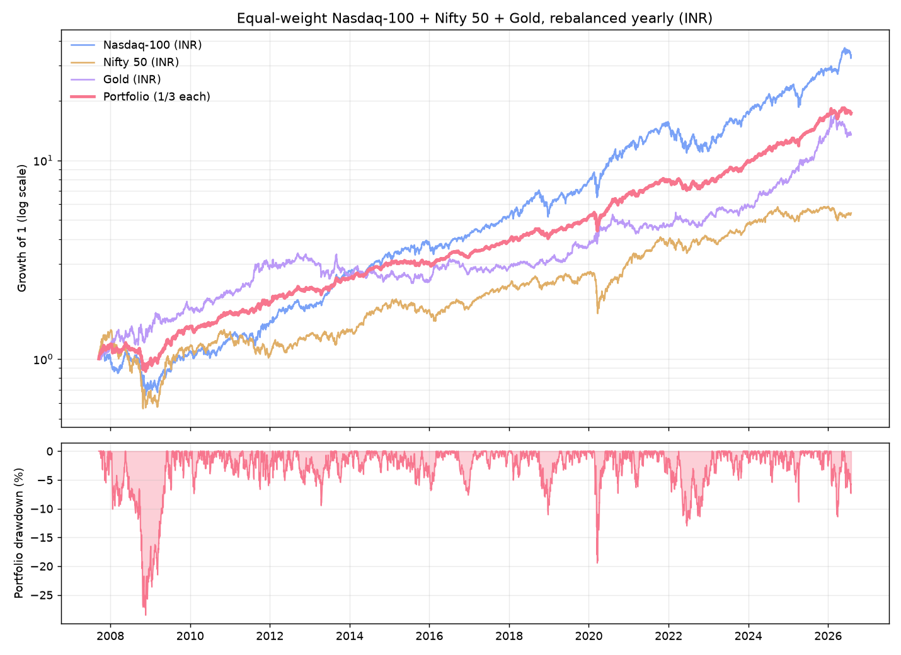

# Equal-Weight Nasdaq-100 + Nifty 50 + Gold — Rebalanced Yearly

Backtest of a simple strategy: put **1/3 of your money in each of Nasdaq-100,
Nifty 50, and Gold**, and **rebalance back to equal weights on the last trading
day of every year**. Everything is measured in **INR** (an Indian investor who
holds Nifty directly and holds the US index / international gold with rupee
money, so USD/INR moves flow into those two legs).

## Headline result

**Window: 17 Sep 2007 → 31 Jul 2026 (≈18.9 years)** — the longest span with a
consistent daily series for all three. Nifty 50's daily index only starts in
Sep 2007, so a full 20.0-year window isn't reconstructable from this data; this
is as close to "last 20 years" as the data honestly allows, and it *includes*
the 2008 crash (it starts just before the pre-GFC peak).

| Instrument | CAGR | Max drawdown | Volatility | Growth of ₹1 |
|---|---:|---:|---:|---:|
| Nasdaq-100 (INR) | 20.5% | −40.5% | 23.7% | 33.9× |
| Nifty 50 (INR) | 9.4% | −59.9% | 21.0% | 5.4× |
| Gold (INR) | 14.8% | −29.5% | 19.7% | 13.5× |
| **Portfolio (⅓ each, yearly rebal.)** | **16.3%** | **−28.5%** | **13.1%** | **17.3×** |

**The blend's max drawdown (−28.5%) is shallower than every single asset, and
its volatility (13.1%) is far below any leg (20–24%)** — while still compounding
at **16.3% a year**. ₹1 lakh invested at the start would be ≈₹17.3 lakh.
Return-per-unit-of-risk (CAGR ÷ volatility) is **1.24** for the portfolio vs
0.87 Nasdaq / 0.75 Gold / 0.45 Nifty — the best of the four. The worst calendar
year was −17% (2008); the portfolio was positive in **17 of 19 years (89%)**.

That is the whole point of the strategy: gold is roughly *uncorrelated* with the
two equity indices (annual-return correlation −0.06 with Nasdaq, −0.11 with
Nifty; Nasdaq–Nifty is +0.58), so it cushions equity crashes.

## Why the drawdown is so much smaller (calendar-year returns, INR %)

| Year | Nasdaq | Nifty | Gold | **Portfolio** |
|---|---:|---:|---:|---:|
| 2007¹ | 2.6 | 36.6 | 13.8 | **17.7** |
| 2008 | −28.8 | −51.8 | +29.6 | **−17.0** |
| 2009 | 48.2 | 75.8 | 19.7 | **47.9** |
| 2010 | 15.1 | 17.9 | 25.3 | **19.5** |
| 2011 | 21.5 | −24.6 | 30.3 | **9.1** |
| 2012 | 20.7 | 27.7 | 10.5 | **19.6** |
| 2013 | 52.3 | 6.8 | −19.0 | **13.3** |
| 2014 | 21.0 | 31.4 | 1.1 | **17.8** |
| 2015 | 13.7 | −4.1 | −6.1 | **1.2** |
| 2016 | 8.2 | 3.0 | 10.9 | **7.4** |
| 2017 | 24.0 | 28.6 | 7.1 | **19.9** |
| 2018 | 8.0 | 3.2 | 6.8 | **6.0** |
| 2019 | 40.7 | 12.0 | 21.2 | **24.7** |
| 2020 | 51.4 | 14.9 | 27.8 | **31.3** |
| 2021 | 28.9 | 24.1 | −1.8 | **17.1** |
| 2022 | −25.4 | 4.3 | 10.8 | **−3.4** |
| 2023 | 52.8 | 20.0 | 12.6 | **28.5** |
| 2024 | 30.2 | 8.8 | 32.9 | **24.0** |
| 2025 | 25.7 | 10.5 | 72.2 | **36.1** |
| 2026¹ | 19.4 | −6.7 | −0.2 | **4.2** |

¹ 2007 and 2026 are partial years (Sep→Dec and Jan→Jul). In **2008** gold's +30%
turned a −40% to −52% equity year into just −17% for the blend; in **2022** gold
and Nifty offset the −25% Nasdaq year.

## Method

- **Data:** Yahoo Finance daily closes — `^NDX` (Nasdaq-100), `^NSEI` (Nifty 50),
  `GC=F` (COMEX gold), `INR=X` (USD/INR). Cached in `data/`.
- **Currency:** Nasdaq-100 and gold closes multiplied by same-day USD/INR; Nifty
  is already INR. USD/INR went 40.2 → 95.4 over the window (≈4.6%/yr), a tailwind
  for the two USD legs.
- **Portfolio:** lump sum, 1/3 each at inception, reset to 1/3 : 1/3 : 1/3 on the
  last trading day of every calendar year. CAGR = (end/start)^(1/years) − 1;
  max drawdown = worst peak-to-trough on the daily equity curve.

Run it yourself: `python3 portfolio_backtest.py` (needs `pandas numpy requests
matplotlib`; delete `data/prices_raw.csv` to re-fetch fresh prices).

## Caveats (read before trusting the exact numbers)

- **Price indices, no dividends.** `^NDX` and `^NSEI` exclude dividends, so real
  total returns are higher by ≈0.8%/yr (Nasdaq) and ≈1.4%/yr (Nifty). Gold pays
  none. Adding dividends would lift the portfolio CAGR by roughly ~0.7%/yr.
- **No costs or taxes.** Fund expense ratios (~0.2–0.6%), tracking error, and the
  capital-gains tax triggered by each annual rebalance would trim ~1–2%/yr in
  practice. Real gold/Nasdaq exposure via Indian funds also carries import-duty
  and FoF frictions.
- **Rupee tailwind.** A big chunk of the Nasdaq and gold INR returns is USD/INR
  depreciation. If the rupee stops falling, those legs return less in INR.
- **Start-date sensitivity.** This window starts near a market top (Sep 2007).
  A different start (e.g. post-2009) would show a higher CAGR and smaller
  drawdown. One historical path is not a guarantee.
- **Gold in 2025** returned ~+72% in INR — an exceptional year that flatters the
  recent numbers; don't extrapolate it.
